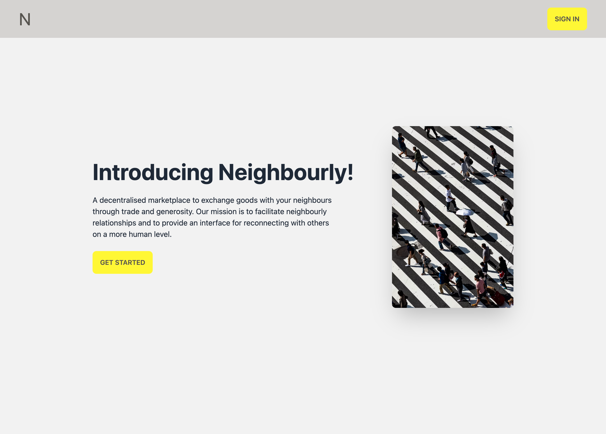
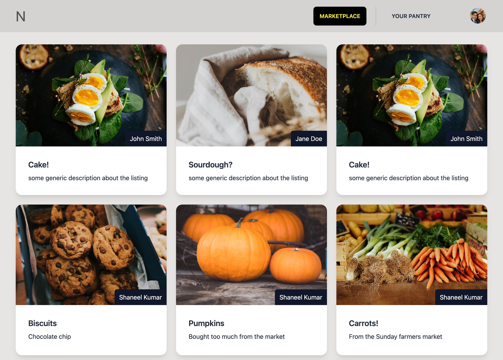
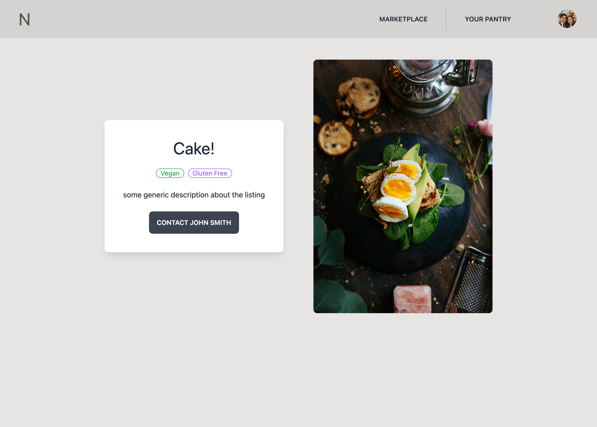
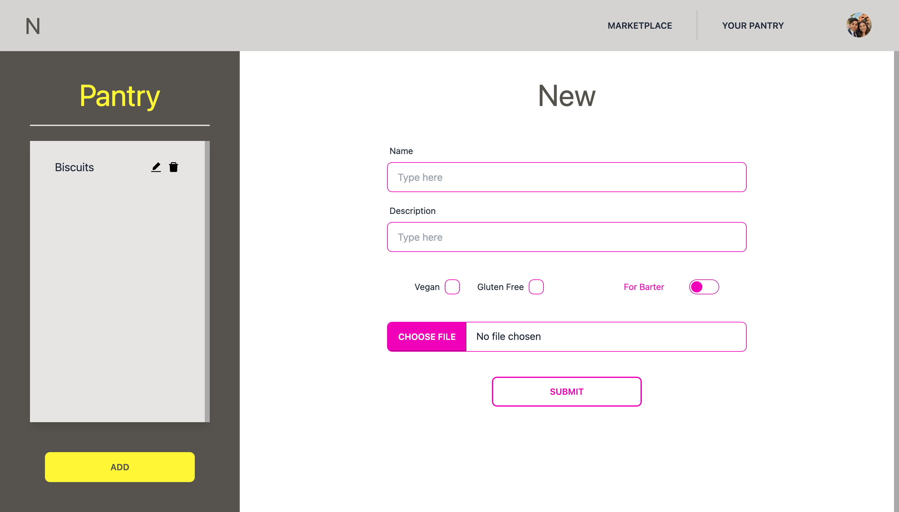
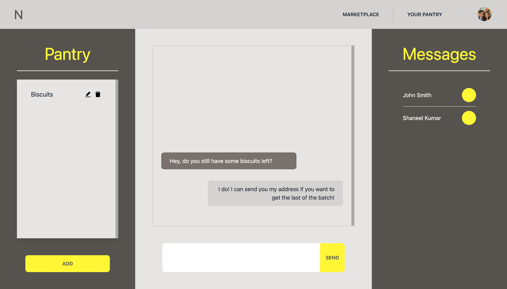

<!--
This is a [Next.js](https://nextjs.org/) project bootstrapped with [`create-next-app`](https://github.com/vercel/next.js/tree/canary/packages/create-next-app).

## Getting Started

First, run the development server:

```bash
npm run dev
# or
yarn dev
```
Open [http://localhost:3000](http://localhost:3000) with your browser to see the result.
-->

# Neighbourly

### [Live Link](https://neighbourly.vercel.app/)

How frustrating is it when you look up an online recipe, just to find you are missing one or two ingredients. Those items are likely not worth going to the supermarket for so you forget the recipe ever existed and order some takeout instead. Or maybe you've baked too many cookies and are wondering what you might do with the extra batch? Have you ever wanted to get to know your neighbours but did not have a good excuse to start a relationship? Well all these problems can be solved with Neighbourly.

Neighbourly is a marketplace on which users can barter/give food away to people in their proximity, and hopefully create meaningful connections. Users can upload and manage their food listings using an online pantry, the contents of which are then available on a shared marketplace that other users can browse. Should you wish to contact another user to obtain their pantry item, you can do so using the instant message feature.

# Getting Started

Follow the instructions below if you would clone this repo! Note that this web app relies on several external API's which can be difficult to set up. Check out the [live link](https://neighbourly.vercel.app/) instead if you just want to have a look at the app's functionality.

1. Clone the repo into your local system.
2. Run 'npm i' to install all the project dependencies. You can find a list of all the dependencies in the package.json file.
3. Populate the environment variable API keys inside the .env.local.example file. Remove the .example extension from the file as well.
4. Run 'npm run dev' and open up local host 3000 to view the web app in development mode.

# Technology

- NextJS (React framework)
- NextAuth (Github Login)
- Redux Toolkit
- Typescript/Javascript
- Tailwind CSS (w/ DaisyUI framework)
- MongoDB

# Challenges

Aside from using the many different technologies that were new to me, I came across two challenges that I did not originally plan for.

1.  Storing images online. I was under the assumption that images could be stored within modern databases (like MongoDB), but unfortunately I was wrong. To remedy this issue, I put in place an API post request to DigitalOcean Spaces that returns a link (url) to the stored image, which I can then put inside a database post request to create a new listing.
2.  Instant messaging feature. I had originally planned to create a system that revealed a user's contact details (with their consent) to another user. The more I thought about this feature, the less I liked the idea of having my phone number/address available to a stranger before I have a chance to vet them. Halfway through the project, I decided to pivot to an instant messaging feature instead. Users can contact each other through listings (by clicking the contact button), which then creates a private channel through which users can talk and exchange details (if they feel comfortable enough to do so).

This was also my first full project using NextJS, Typescript and MongoDB. I really enjoyed using this tech and learnt quite a few lessons that I am excited to take forward into future projects.

# Screenshots

### The app is fully mobile responsive! Check out the live link and play around with the screen sizes.

## Home

## Marketplace

## Listing

## Pantry

## Messages


